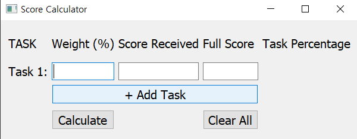
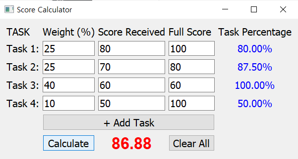
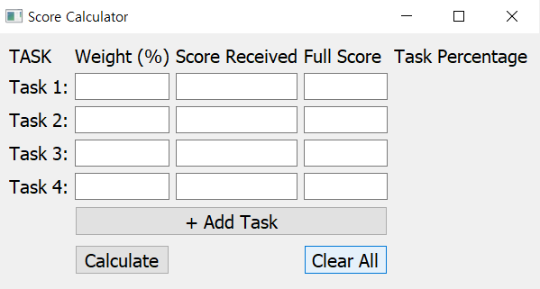
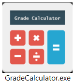

# Grade Calculator
Score Calculator is a program that allows users to calculate grades for each task based on their weight and score.

## Prerequisites
To run this application, you need to have Python3 and the pyqt5 library installed on your machine.
## Installation
1. Clone this repository to your local machine.
2. Open a terminal or command prompt and navigate to the cloned repository.
3. Type the following command to run the application
    `python GradeCalculator.py`
4. The GUI window should appear on your screen.

## Usage
1. Launch the Score Calculator program.
   
2. Enter the information for each task in the program window.
3. Click the "Calculate" button to calculate the score.

5. Click the "Clear All" button to clear all the input fields.
    

## How to create an executable file
If you want to create an executable file (.exe) from this Python script, you can use the PyInstaller library.
Here's an example comman to create a single-file executable:  
`pyinstaller --onefile GradeCalculator.py`

You can also specify an icon file and hide the console window by using the following command:  
`pyinstaller --onefile --noconsole --icon=icon.ico --hidden-import=PyQt5 GradeCalculator.py`  
 
`
## To-Do

Add Remove Task button from task2 ~
